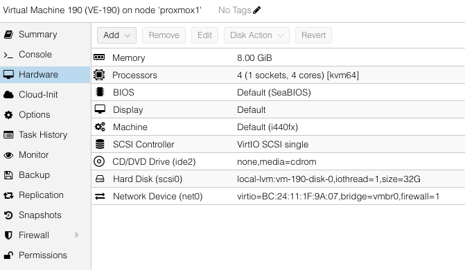
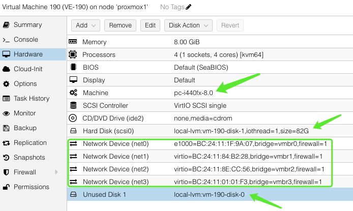
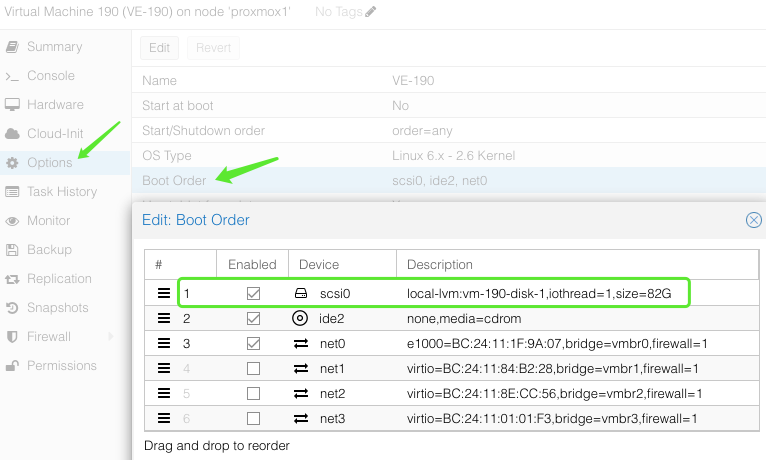

### Setup BigIP-VE on Proxmox
1. Create a VM
2. Import disk from qcow2 image
3. Adjust VM hardware setting
4. BigIP-VE initial setup
5. Supplementary Info.

### 1. Create a VM
+ Create a VM  
  + e.g. Machine ID 190
    

### 2. Import disk from qcow2 image
+ Import disk from qcow2 image
  + e.g. qm importdisk 190 /root/f5/images/VE/BIGIP-17.1.1.3-0.0.5.qcow2 local-lvm

### 3. Adjust VM hardware setting
+ Machine : pc-i440fx-**8.0** (8.2 may cause BigIP-VE license activation failure)
+ Add NICs
+ Detach and Remove default disk
+ Attach imported disk  
  
+ Update boot order  
  

### 4. BigIP-VE initial setup
+ BigIP-VE initial setup via Proxmox console
  + Logon as root/default
  + Disable mgmt-dhcp
    + tmsh modify sys global-settings mgmt-dhcp disabled
  + Configure mgmt-ip, gateway
    + tmsh create sys management-ip 192.168.100.190/24
    + tmsh create sys management-route default gateway 192.168.100.1
  + Save config
    + tmsh save sys config

### 5. Supplementary Info.
+ How to deploy BIG-IP VE with Proxmox Virtual Environment
  https://my.f5.com/manage/s/article/K85183351

