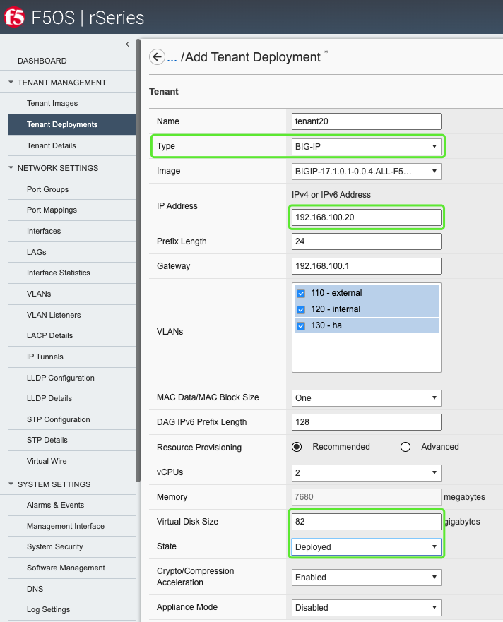
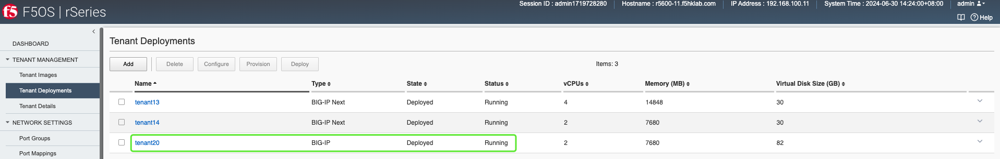

### Setup BigIP VE on r5600
1. Deploy a tenant
2. Setup BigIP VE as usual

### 1. Deploy a tenant
+ Tenant Deployments
  + e.g. tenant20, 192.168.100.20  
  
  + Check Status
  

### 2. Setup BigIP VE as usual
+ Configure BigIP VE via GUI
  + e.g. https://192.168.100.20

