### Setup Central Manager (20.2.1) on Proxmox
1. Import OVF & NIC
2. Run CM setup script via Console ***(Check pods status before running setup)***
3. CM full installation via GUI
4. ***Somehow App Migration by using UCS failed***
5. Supplementary Info.

### 1. Import OVF & NIC
+ Create & Start a new VM, e.g. VM-ID 211
  ```
  qm importovf 211 BIG-IP-Next-CentralManager-20.2.1-0.3.25.ovf local-lvm
  qm set 211 --cores 16 --memory 32768 --net0 virtio,bridge=vmbr0
  qm start 211
  ### qm stop 211
  ### qm destory 211
  ```
  ```
  {
      "created": "2024-07-23T03:32:45.554043094Z",
      "status": "RUNNING",
      "step": "Installing kafka...",
      "updated": "2024-07-23T03:36:33Z"
  }
  ```
+ Do ***NOT*** support qcow format (Need qcow2) 
  ```
  qm importdisk 212 BIG-IP-Next-CentralManager-20.2.1-0.3.25.qcow local-lvm
  qm set 212 --cores 16 --memory 32768 --net0 virtio,bridge=vmbr0
  qm start 212
  ```
+ Using default HW setting is fine
  + e.g. 16G memory, 8 vCPU, Default machine type (i.e. i440fx, version 8.2)
  + No need Cloud-init drive, 

+ Check pods status before running setup
  + It takes 5 mins or more
  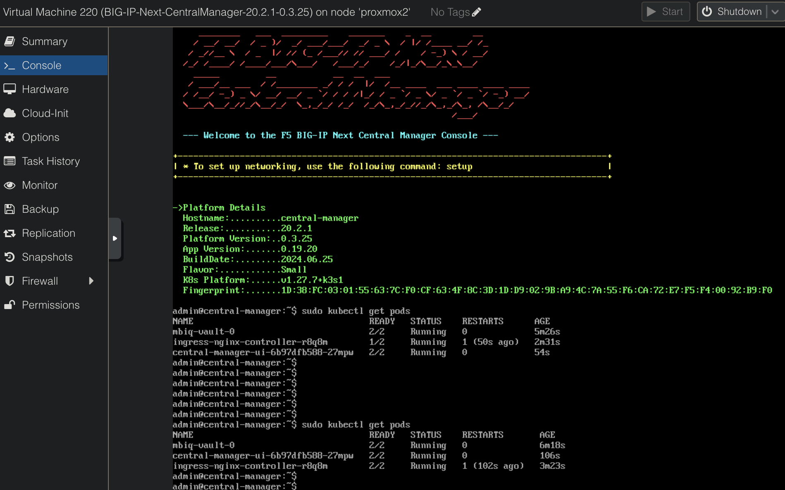


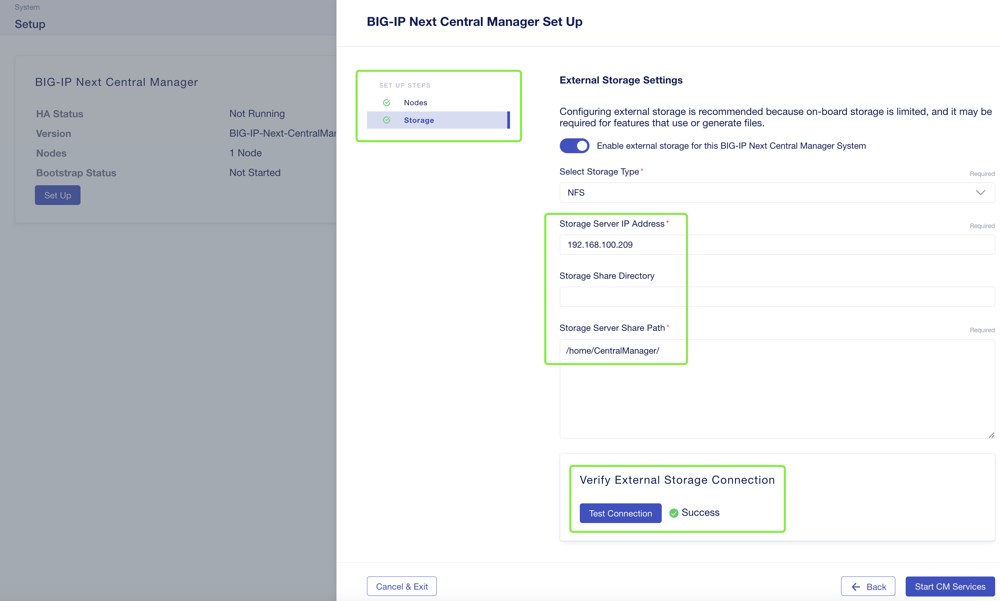
### 2. CM initial setup via Console ***(Check pods status before running setup)***
+ Logon as admin/admin
  
+ Run setup script
  
  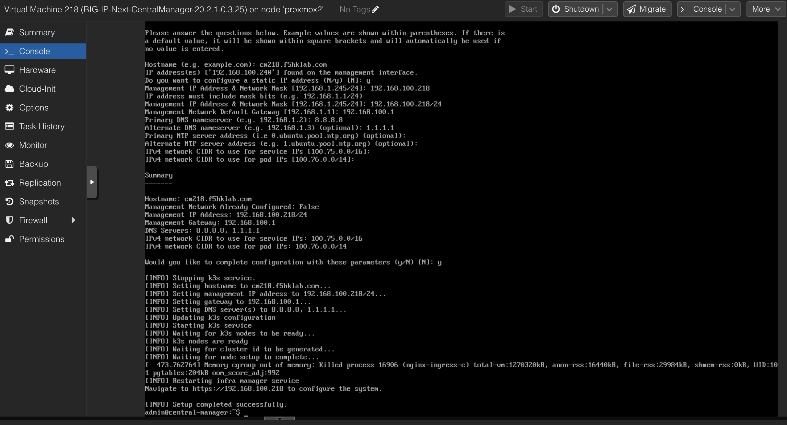

### 3. CM full setup via GUI
+ Logon as admin/admin
+ Run CM Setup
  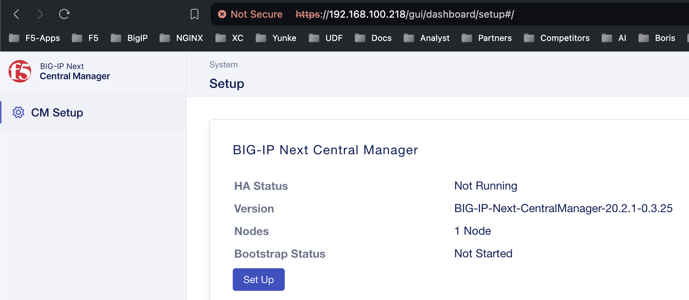
+ ***Make sure Select Node(s) for installation*** 
+ ***Make sure Storage circle become GREEN*** 
  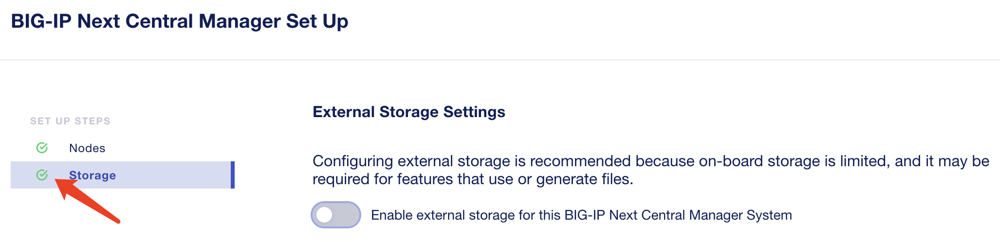
  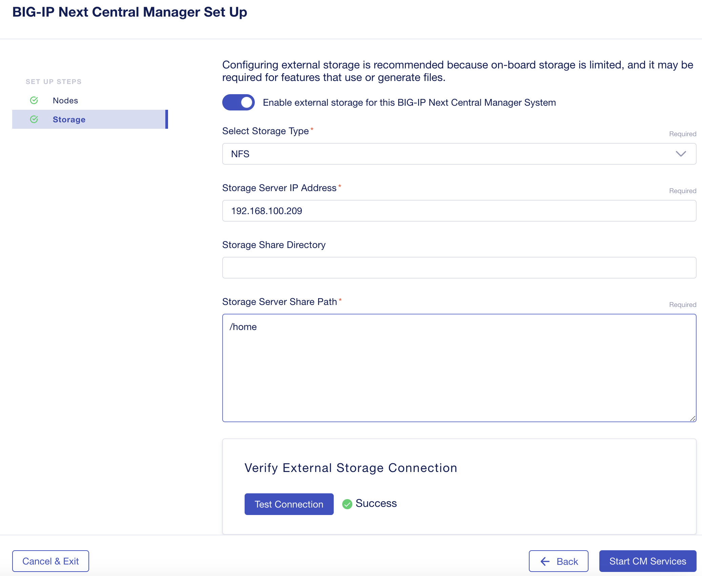
  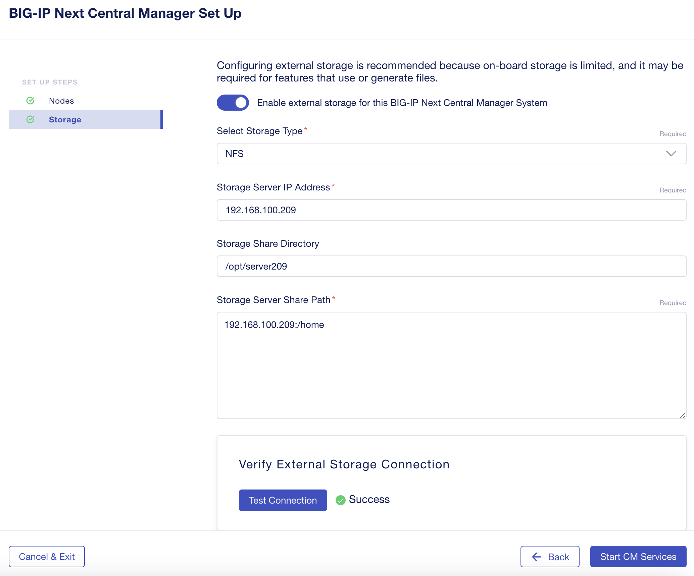
  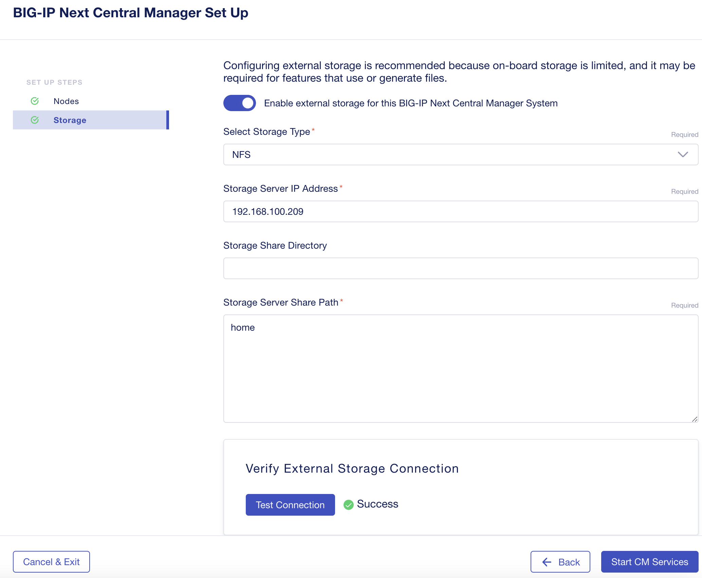
  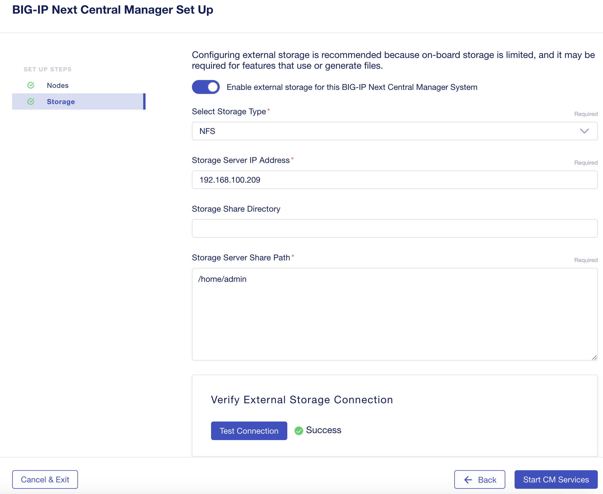
+ It may show "Unable to load bootstrap info." but never mind
  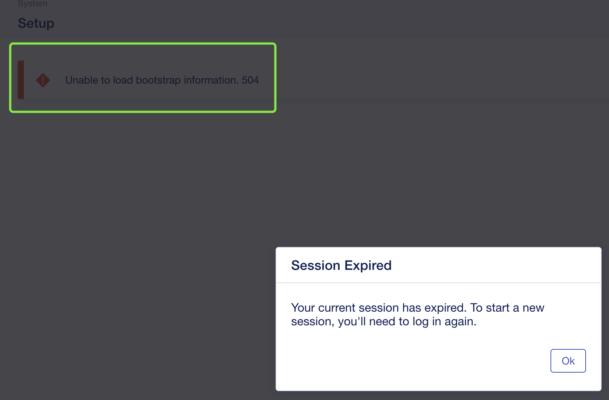
+ Wait 10+ mins and then logon again 

### 4. ***Somehow App Migration by using UCS failed***
+ Migrate a BIG-IP user configuration set (UCS) to BIG-IP Next instances
  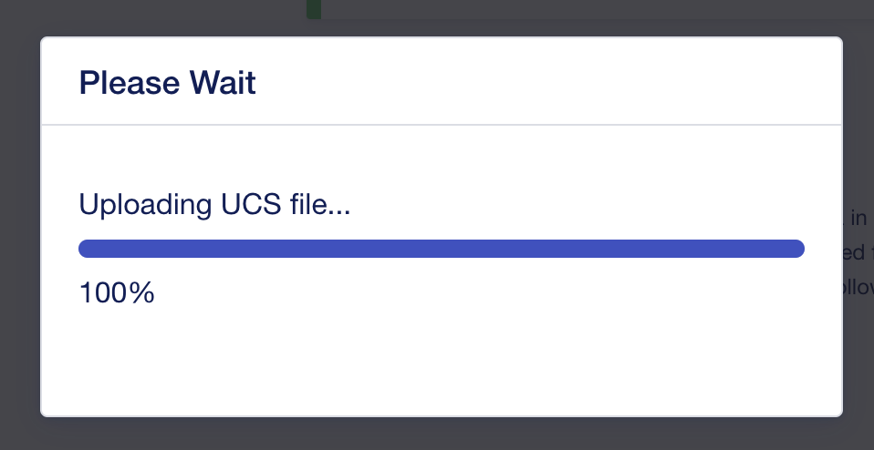
  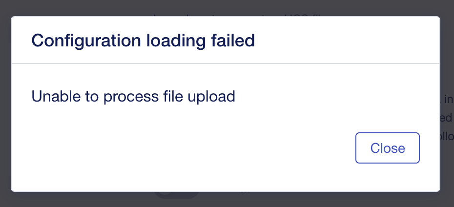
+ ***No issue if using ESXi6.7.***

### 5. Supplementary Info.
+ NFS Server
  ```
  sudo apt install nfs-kernel-server
  sudo mkdir /home/CentralManager
  sudo chown +777 /home/CentralManager
  ```
  
  ```
  f5admin@Ubuntu-209:/home$ more /etc/exports
  # /etc/exports: the access control list for filesystems which may be exported
  #		to NFS clients.  See exports(5).
  #
  # Example for NFSv2 and NFSv3:
  # /srv/homes       hostname1(rw,sync,no_subtree_check) hostname2(ro,sync,no_subtree_check)
  #
  # Example for NFSv4:
  # /srv/nfs4        gss/krb5i(rw,sync,fsid=0,crossmnt,no_subtree_check)
  # /srv/nfs4/homes  gss/krb5i(rw,sync,no_subtree_check)
  #

  #/home/CentralManager    *(rw,sync,no_subtree_check)
  /home/CentralManager	*(rw,insecure,sync,no_subtree_check,no_root_squash)
  ```

+ no_root_squash for allowing chown
  ```
  f5admin@Ubuntu-209:/home$
  f5admin@Ubuntu-209:/home$ sudo systemctl stop nfs-kernel-server.service
  f5admin@Ubuntu-209:/home$ sudo exportfs -a
  f5admin@Ubuntu-209:/home$ sudo systemctl start nfs-kernel-server.service
  ```

+ Test NFS from MAC
  ```
  h.siu@J34JML4DVJ ~ % showmount -e 192.168.100.209
  Exports list on 192.168.100.209:
  /home/CentralManager                *
  h.siu@J34JML4DVJ ~ %
  ```

+ chown is required
  ```
  "failed to configure storage: failed to configure storage, chown: changing ownership of '/mnt/external-storage/735ca9e3-2893-4f60-bb6e-d21fe1fa508e/cm-backup': Operation not permitted\n, exit status 1"
  ```

+ Still something wrong...
  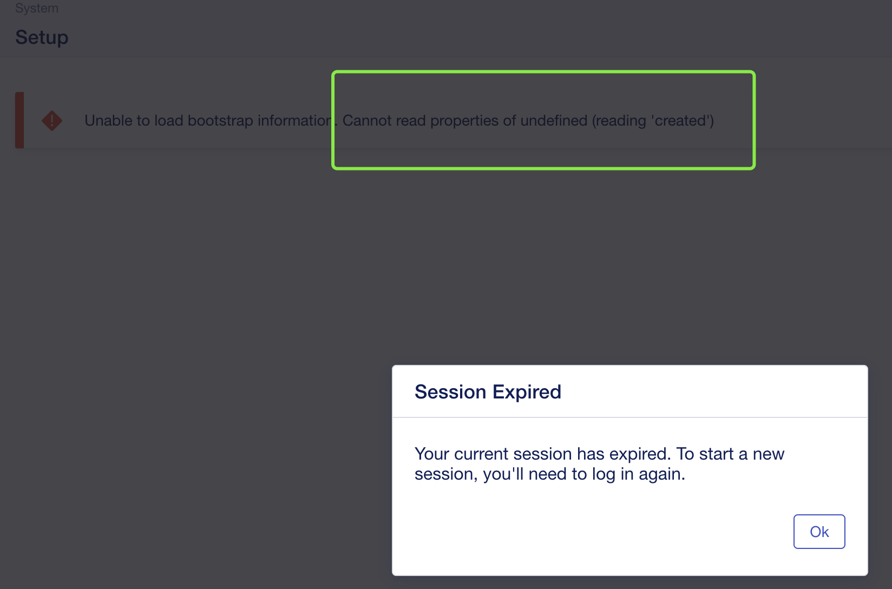

```
sudo apt install nfs-common
sudo mkdir /opt/CentralManager
sudo mount 192.168.100.209:/home/CentralManager /opt/CentralManager
```

```
An alternate way to mount an NFS share from another machine is to add a line to the /etc/fstab file. The line must state the hostname of the NFS server, the directory on the server being exported, and the directory on the local machine where the NFS share is to be mounted.

The general syntax for the line in /etc/fstab file is as follows:

example.hostname.com:/srv /opt/example nfs rsize=8192,wsize=8192,timeo=14,intr
```


