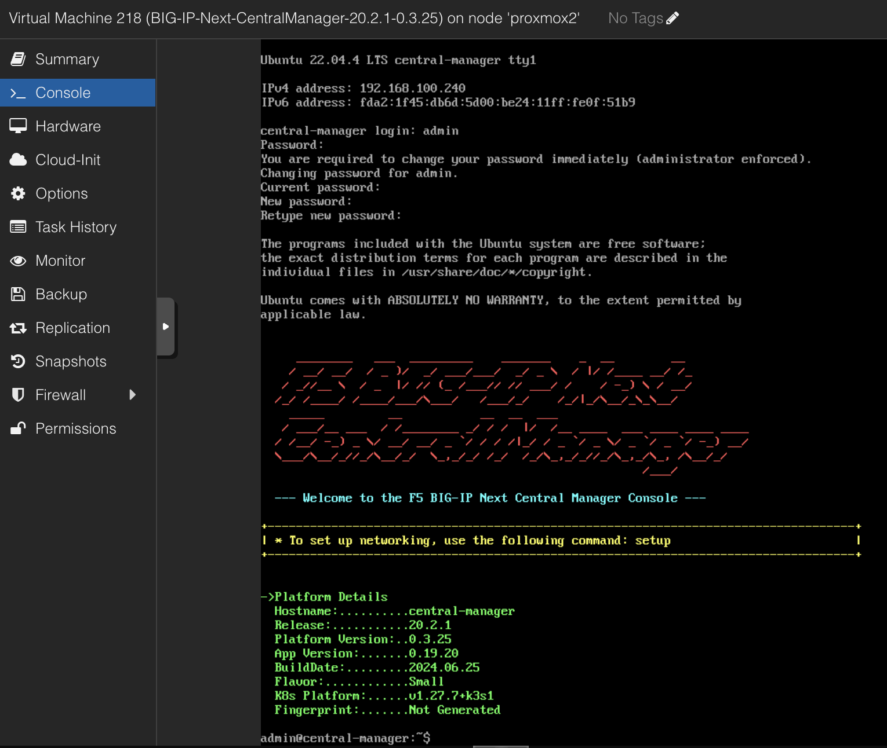
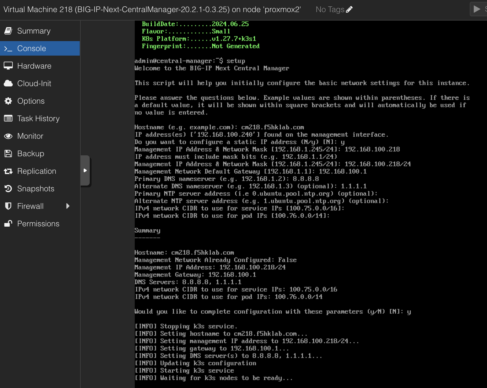

### Setup Central Manager (20.2.1) on Proxmox
1. Import OVF & NIC
2. Run CM setup script via Console
3. CM full installation via GUI
4. ***Somehow App Migration by using UCS failed***
5. Supplementary Info.

### 1. Import OVF & NIC
+ Create VM ID 218
  ```
  qm importovf 218 BIG-IP-Next-CentralManager-20.2.1-0.3.25.ovf local-lvm
  qm set 218 --cores 16 --memory 32768 --net0 virtio,bridge=vmbr0
  ```
+ Start the VM by using default HW setting
  + e.g. 16G memory, 8 vCPU
  + Default machine type (i.e. i440fx, version 8.2)
  + No Cloud-init drive, 

### 2. CM initial setup via Console
+ Logon as admin/admin
  
+ Run setup script
  
  

### 3. CM full setup via GUI
+ Logon as admin/admin
+ Run CM Setup
  
+ ***Make sure Storage circle become GREEN*** 
  
  
  
  
  
+ It may show "Unable to load bootstrap info." but never mind
  
+ Wait 10+ mins and then logon again 

### 4. ***Somehow App Migration by using UCS failed***
+ Migrate a BIG-IP user configuration set (UCS) to BIG-IP Next instances
  
  
+ ***No issue if using ESXi6.7.***

### 5. Supplementary Info.
+ NFS Server
  ```
  f5admin@Ubuntu-209:/home$ more /etc/exports
  # /etc/exports: the access control list for filesystems which may be exported
  #		to NFS clients.  See exports(5).
  #
  # Example for NFSv2 and NFSv3:
  # /srv/homes       hostname1(rw,sync,no_subtree_check) hostname2(ro,sync,no_subtree_check)
  #
  # Example for NFSv4:
  # /srv/nfs4        gss/krb5i(rw,sync,fsid=0,crossmnt,no_subtree_check)
  # /srv/nfs4/homes  gss/krb5i(rw,sync,no_subtree_check)
  #

  #/home/CentralManager    *(rw,sync,no_subtree_check)
  /home/CentralManager	*(rw,insecure,sync,no_subtree_check,no_root_squash)
  ```

+ Test NFS from MAC
  ```
  h.siu@J34JML4DVJ ~ % showmount -e 192.168.100.209
  Exports list on 192.168.100.209:
  /home/CentralManager                *
  h.siu@J34JML4DVJ ~ %
  ```

+ chown is required
  ```
  "failed to configure storage: failed to configure storage, chown: changing ownership of '/mnt/external-storage/735ca9e3-2893-4f60-bb6e-d21fe1fa508e/cm-backup': Operation not permitted\n, exit status 1"
  ```

+ no_root_squash for allowing chown
  ```
  f5admin@Ubuntu-209:/home$
  f5admin@Ubuntu-209:/home$ sudo systemctl stop nfs-kernel-server.service
  f5admin@Ubuntu-209:/home$ sudo exportfs -a
  f5admin@Ubuntu-209:/home$ sudo systemctl start nfs-kernel-server.service
  ```

+ Still something wrong...
  