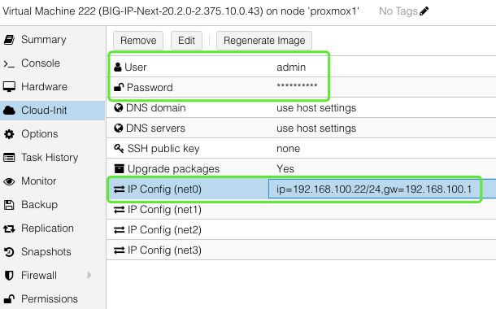

### Setup Next-VE on Proxmox
1. Import **ovf**
2. **Add Cloudinit** & NICs
3. Start Next-VE and then **Remove Cloudinit**
4. Run setup script
5. Manage by Central Manager
6. Activate License

### Import ovf
+ ssh to proxmox, e.g. ssh root@192.168.100.2 or ssh root@192.168.100.3
+ import ovf, e.g. qm importovf 222 /root/f5/images/BigIP-Next/VE-Next/BIG-IP-Next-20.2.0-2.375.1+0.0.43.ovf local-lvm

### Add Cloudinit & NICs

### Start Next-VE and then Remove Cloudinit
+ Start Next-VE
+ Remove CloudInit Drive. Otherwise, CLI access may fail in next bootup.

### Run setup script

+ Check status, e.g. sudo kubectl get pods

### Manage by Central Manager
+ Connect to CM, e.g. https://192.168.100.210
+ 

### Activate License

### Supplementary Info.
+ https://community.f5.com/kb/technicalarticles/create-f5-big-ip-next-instance-on-proxmox-virtual-environment/326446

+ Ubuntu 22.04.4 TLS
+ 

