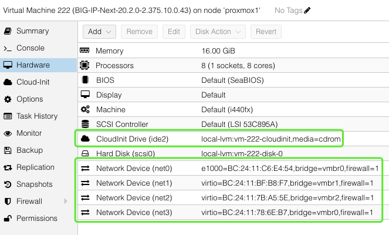
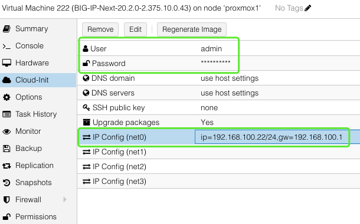
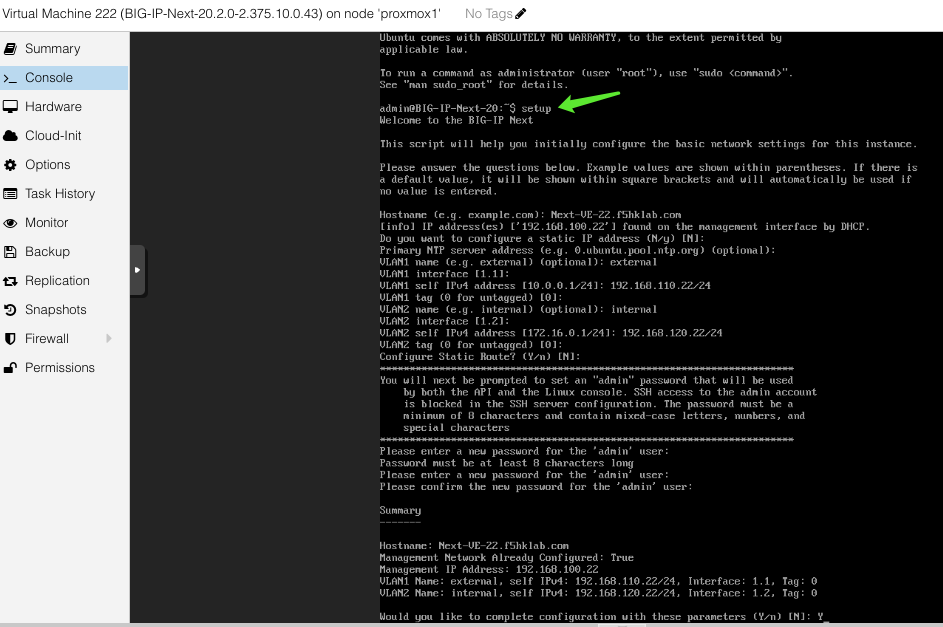
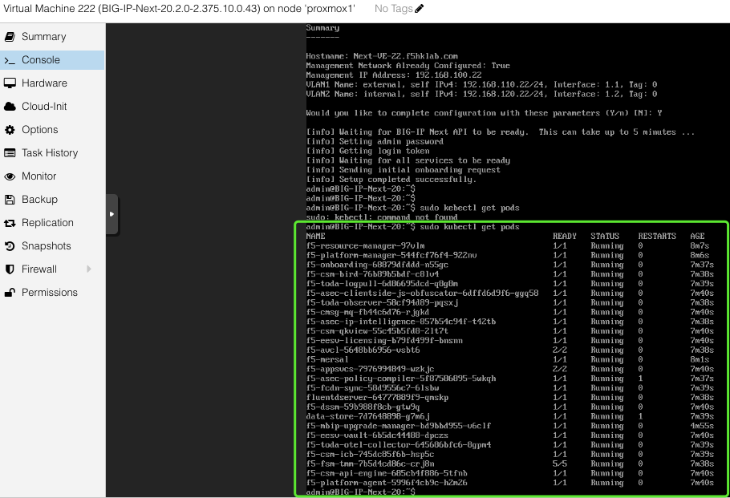
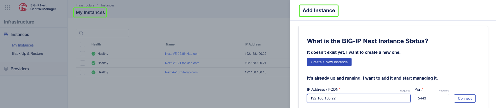
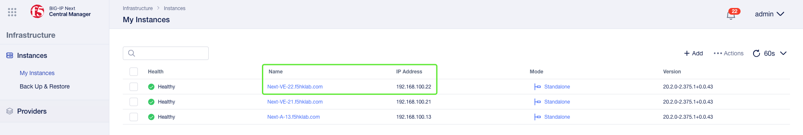
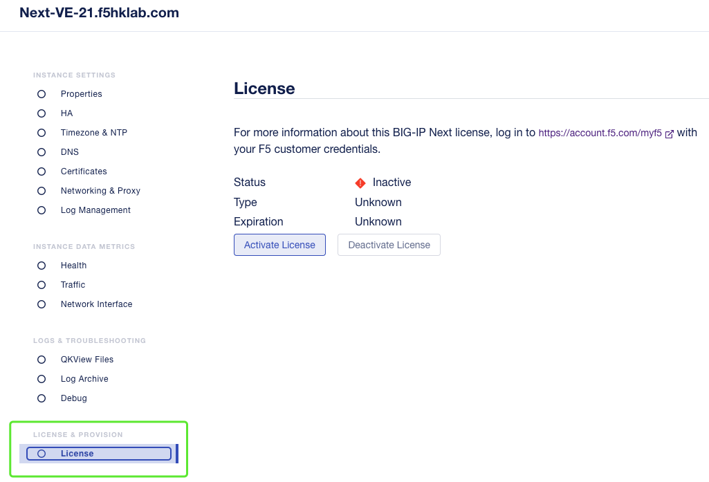
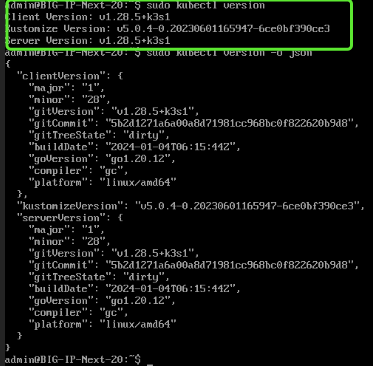

### Setup Next-VE on Proxmox
1. Import **ovf**
2. Add NICs & **Cloudinit Drive** 
3. Start Next-VE and then **Remove Cloudinit Drive**
4. Run setup script
5. Manage by Central Manager
6. Activate License
7. Supplementary Info.

### 1. Import ovf
+ ssh to proxmox
  + e.g. ssh root@192.168.100.2
+ import ovf
  + e.g. qm importovf 222 /root/f5/images/BigIP-Next/VE-Next/BIG-IP-Next-20.2.0-2.375.1+0.0.43.ovf local-lvm

### 2. Add NICs & Cloudinit Drive
+ Add NICs (E1000 for mgmt and Virtio for others)
+ Add Cloudinit Drive  
  
+ Set Cloudinit info.
  + e.g. admin/admin, ip=192.168.100.22/24, gw=192.168.100.1  
  

### 3. Start Next-VE and then Remove Cloudinit Drive
+ Start Next-VE
+ Remove CloudInit Drive. Otherwise, CLI access may fail in next bootup.

### 4. Run setup script
+ Change admin password, e.g. Welcome123!
  

+ Check status, e.g. sudo kubectl get pods
  

### 5. Manage by Central Manager
+ Connect to CM
  + e.g. https://192.168.100.210
+ Add Instance
  + password = Welcome123!
  
+ Results  
  

### 6. Activate License
+ Update the instance
  

### 7. Supplementary Info.
+ admin account was disable after running setup
+ BIG-IP-Next-20.2.0-2.375.1+0.0.43
  + Ubuntu 22.04.4 TLS
  + K8S version  
    
+ https://community.f5.com/kb/technicalarticles/create-f5-big-ip-next-instance-on-proxmox-virtual-environment/326446
+ Postman Collection  
  https://clouddocs.f5.com/bigip-next/latest/_downloads/306e939fa3b8d36fdf0d8b7a9aaf6328/BIG-IP-Next-Postman-Collection-v20.2.0-4.15.61-0.0.3.zip

