### Setup Next-VE on r5600
1. Deploy a tenant
2. Setup tenant via Postman
3. Manage by Central Manager
4. Activate License
5. Supplementary Info.

### 1. Deploy a tenant
+ Tenant Deployments
  + e.g. tenant14, 192.168.100.14  
  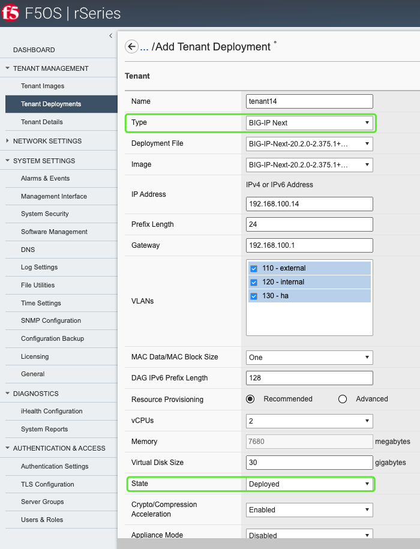
  + Check Status
  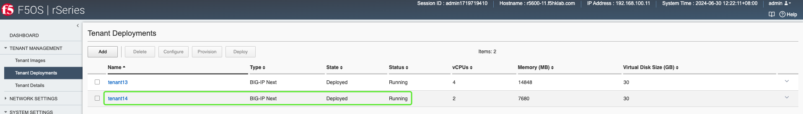

### 2. Setup tenant via Postman
+ Install Postman collection, see supplementary info. for details
  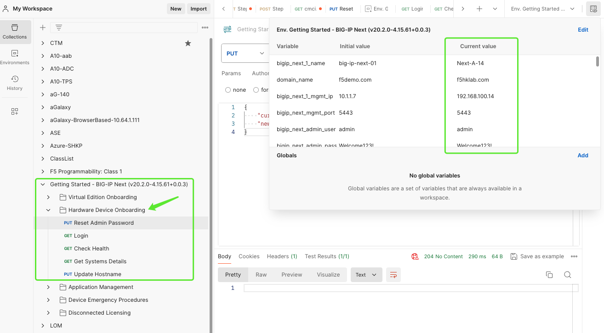
+ Reset Admin Password
  + e.g. Welcome123!
  + 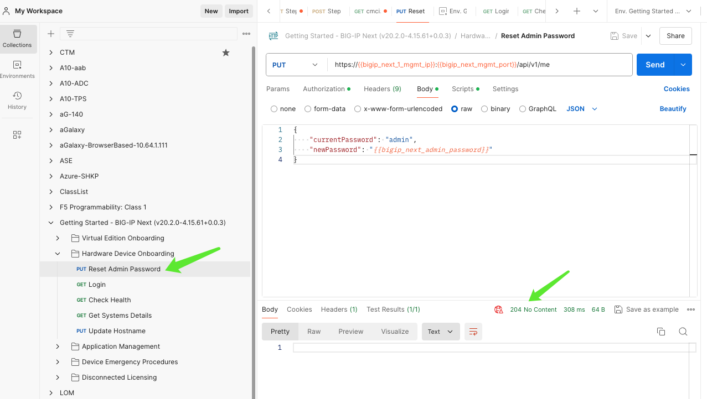
+ Login
  + 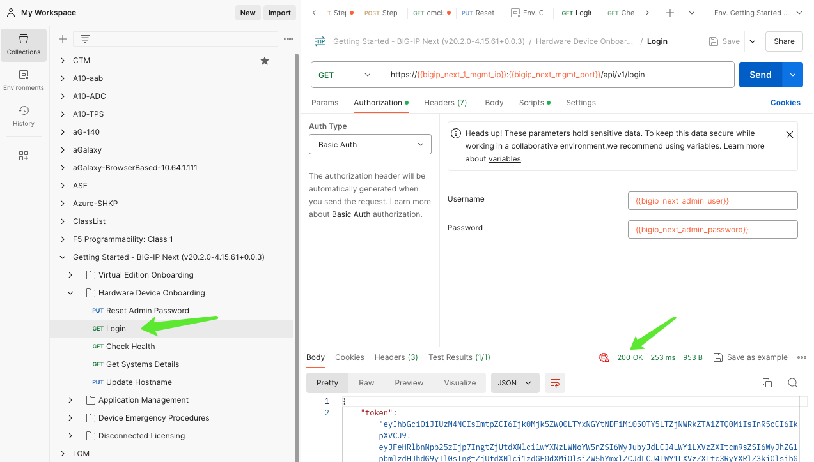
+ Update Hostname
  + 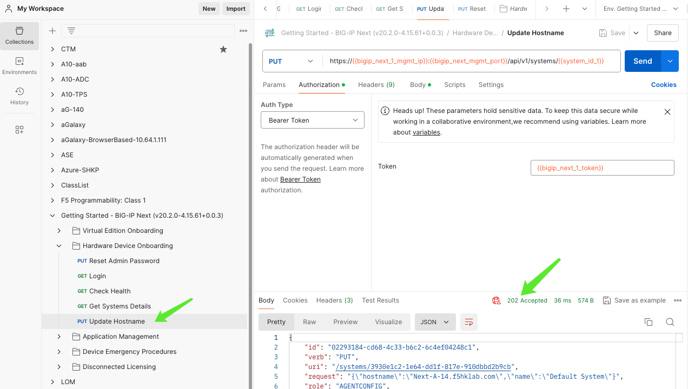
+ Check Hostname
  + 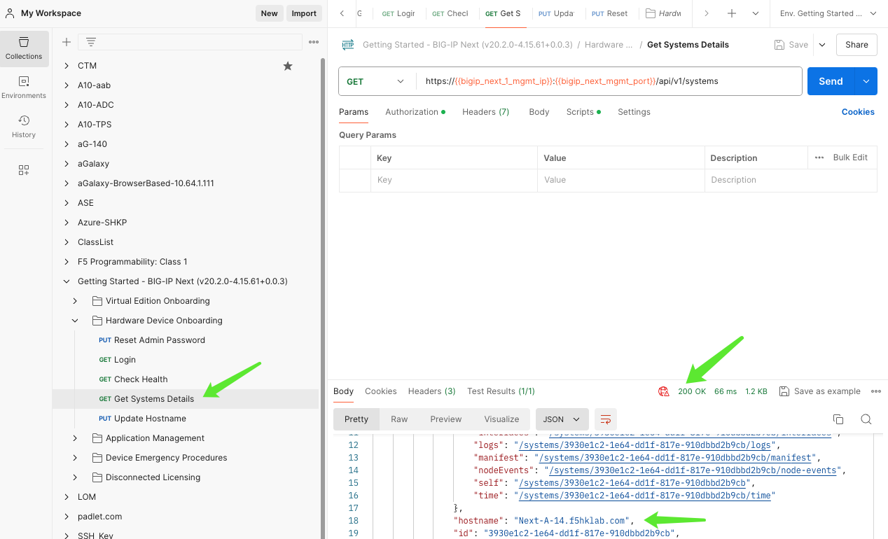

### 3. Manage by Central Manager
+ Connect to CM
  + e.g. https://192.168.100.210
+ Add New Instance
  + password = Welcome123!
  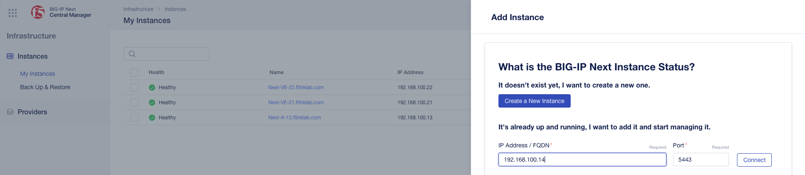
+ Results
  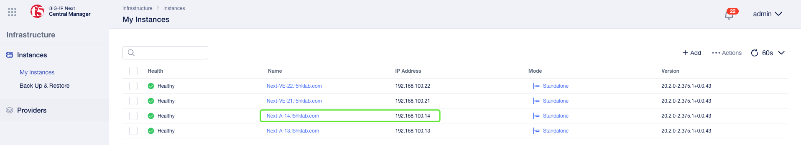

### 4. Activate License
+ Update the instance
  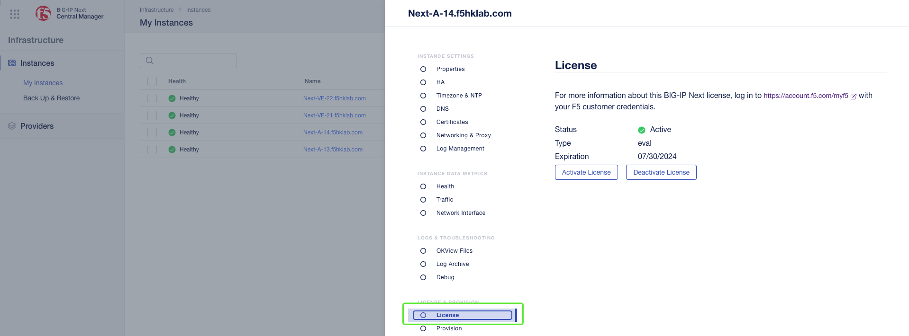

### 5. Supplementary Info.
+ Upgrade F5OS to 1.7.0
  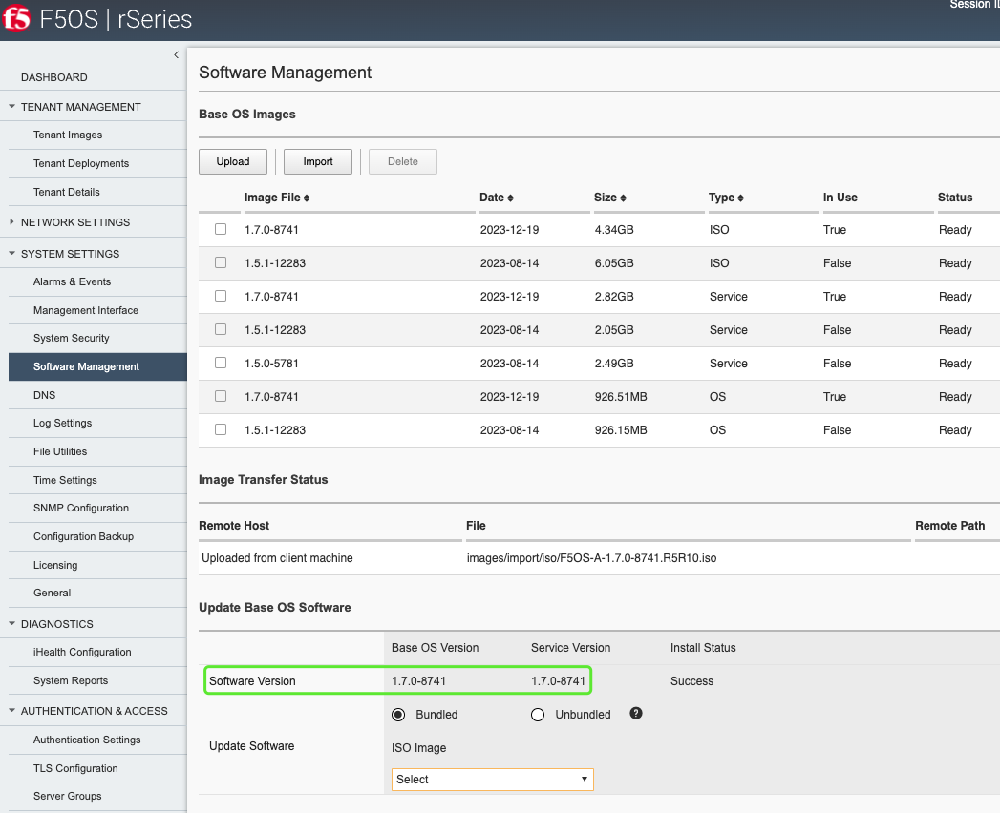
